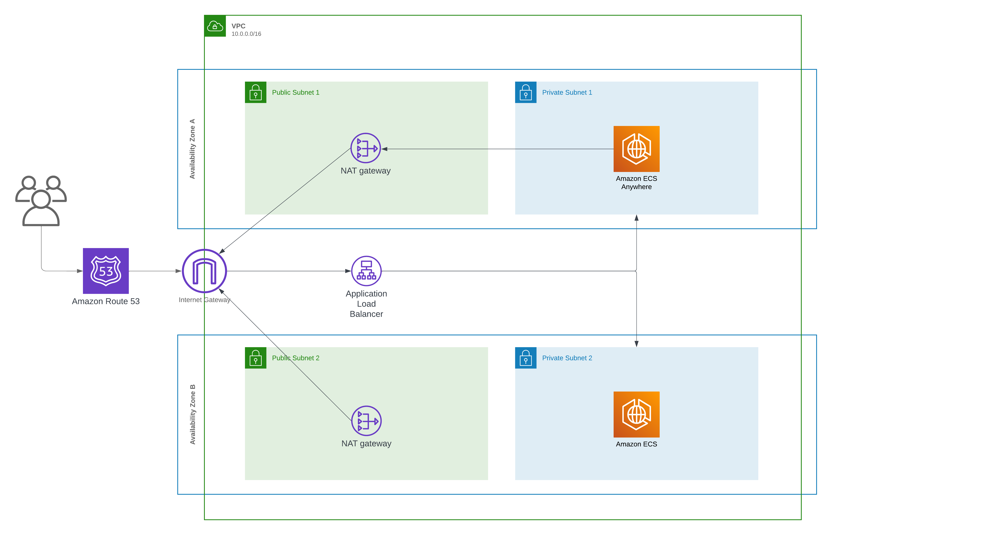

# PUBLIC WEB SERVER WITH ECS

## Overview and Architecture
This project provides a comprehensive setup for deploying a web server on AWS using Docker and Terraform. It utilizes a private repository for Docker images and an ECS service for the web server. The configuration is designed to ensure scalability, high availability, and security.

The architecture is shown below, with the deployment set in a single region with 2 availability zones.



## Prerequisites
Before you begin, ensure you have the following installed on your system:

### 1. AWS CLI 
    - Used to communicate with AWS services. Make sure it's configured with at least one profile.
### 2. Docker 
    - Required for building and pushing the Docker image to the AWS ECR (Elastic Container Registry).
### 3. Terraform 
    - Used for infrastructure as code to provision and manage AWS resources.

## Project Structure

### Module
- `alb.tf`: Defines the Application Load Balancer (ALB) that routes incoming traffic to the appropriate ECS service. It includes the ALB itself, listeners, and target groups.
- `ecr.tf`: Creates an Elastic Container Registry (ECR) repository where your Docker images will be stored. This is where you push the Docker image of your web server.
- `ecs.tf`: Sets up the Amazon Elastic Container Service (ECS) resources, including the ECS cluster, task definitions that describe your containers, and the service which manages running instances of your containers.
- `iam.tf`: Manages AWS Identity and Access Management (IAM) roles and policies needed for ECS to access other AWS services like ECR and logging to CloudWatch.
- `sg.tf`: Defines the security groups used to control access to the ECS service and the ALB. It typically includes inbound and outbound rules for allowed traffic.
- `variable.tf`: Declares variables used within the module, allowing for customisation and reusability of the module without hardcoding values.
- `vpc.tf`: Establishes the Virtual Private Cloud (VPC) network configuration. This includes subnets, route tables, and internet gateways necessary for the ECS instances and ALB to communicate with the internet and other AWS services.
- `main.tf`: Specifies the domain registration and configuration connection to the ALB

### Root Directory Files
- `data.tf`: Contains data source configurations which allow Terraform to use information defined outside of Terraform, or defined by another separate Terraform configuration.
- `Dockerfile`: A script containing commands to assemble the Docker image of the web server. This includes the base image, software installations, configurations, and the application to run.
- `main.tf`: The primary entry point for Terraform configurations, invoking the webserver-module with specific parameters and possibly other Terraform resources or modules.
- `providers.tf`: Specifies the required providers (such as AWS) and their configurations, including version constraints and provider features. It also includes backend configuration for storing the Terraform state, such as in an S3 bucket.
- `terraform.tfvars`: A file for defining values for your variables. It allows for easy customisation of Terraform deployments without altering the main configuration.
- `variables.tf`: Declares variables to be used across your configurations, allowing for flexibility and parameterisation of your Terraform code.


## Deployment Steps

To deploy this project, follow these steps:

### 1. Set Up AWS Resources for Terraform State
Create an S3 bucket and a DynamoDB table for storing the Terraform state and managing locks. This ensures that your Terraform state is secure and that concurrent executions do not cause state corruption.

```shell
aws s3 mb s3://<bucket-name> --region <region>
aws dynamodb create-table --table-name <dynamodb-table-name> --attribute-definitions AttributeName=LockID,AttributeType=S --key-schema AttributeName=LockID,KeyType=HASH --provisioned-throughput ReadCapacityUnits=1,WriteCapacityUnits=1 --region <region>
```

### 2. Clone Repo and Initialise Terraform

- Clone the repository

```shell
git clone https://github.com/TheSoldier103/public_web_aws_ecs.git
```

- Navigate to the `providers.tf` file and update the backend configuration with created values

- Initialise Terraform
Navigate to your Terraform configuration directory (where your providers.tf and module definitions reside) and initialise Terraform. This will download the necessary providers and initialise the backend.

Modify the `terraform.tfvars` file as necessary.

```shell
terraform init
terraform plan
terraform apply
```

### 3. Verify Deployment
After applying your Terraform configuration and pushing the Docker image, your ECS service should be up and running. 

You can verify this by checking navigating to the public URL in your `terraform.tfvars` file.